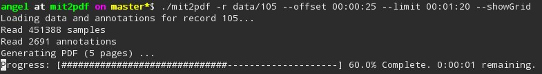
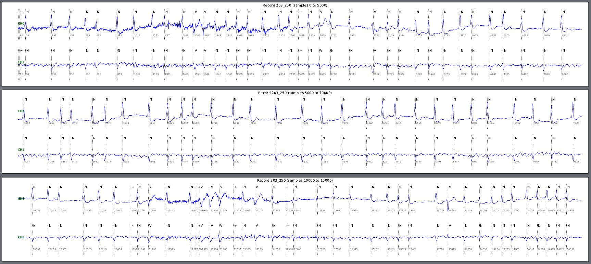
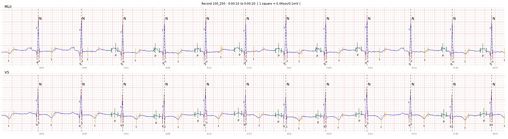

## mit2pdf

Utility to generate an annotated PDF from a MIT-BIH record.
By default MIT-BIH beat annotations are used if present, but you can also provide your own annotations in an easy way.   

Execution is as easy as follows:
    

Result will look like this:

### Annotations format

It is possible to print some annotations over the signal like waves an peaks. For this you need to provide an extra annotations file using the `-b` option.
The file must be a comma separated CSV, with an annotation per line, and every line must have, from left to right, the following fields:
 
 * `sample` Position of the annotation in samples from the beginning of the record
 * `channel` Channel where the annotation must be placed. Use `*` for all channels.
 * `type` Annotation type. Supported types are wave start (`[`), wave end (`]`)  and peak (`^`)
 * `label` A text label to draw next to the annotation mark
 
The following line represents an annotation of a peak (`^`) at the sample 1668 of the first channel, with the label *'r'* 

    1668,0,^,r  

Annotated PDFs look like:

### Other available options:

      
 `-r RECORD` `--record=RECORD` Record to print
      
 `-a ANNOTATOR` `--annotator=ANNOTATOR` Annotator to use (default=atr)
       
 `-o OFFSET` `--offset=OFFSET` Offset to start printing in seconds or as an absolute instant in the format hh:mm:ss (default=0)
      
 `-l LIMIT` `--limit=LIMIT`  Limit to print in seconds or as an absolute instant in the format hh:mm:ss (default=0)
      
 `-p PAGESIZE` `--pageSize=PAGESIZE` Number of seconds per page (default=10)
      
 `-f FILTER` `--filter=FILTER` Filter beat classes shown Ex:N,V
      
 `-b BEATINFO` `--beatInfo=BEATINFO` File with beat info (i.e. waves, peaks, ...)
      
 `-d OUTPUT` `--destination=OUTPUT` Output file
  
 `--showSamples` Show sample numbers

