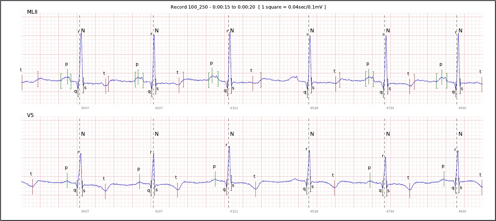
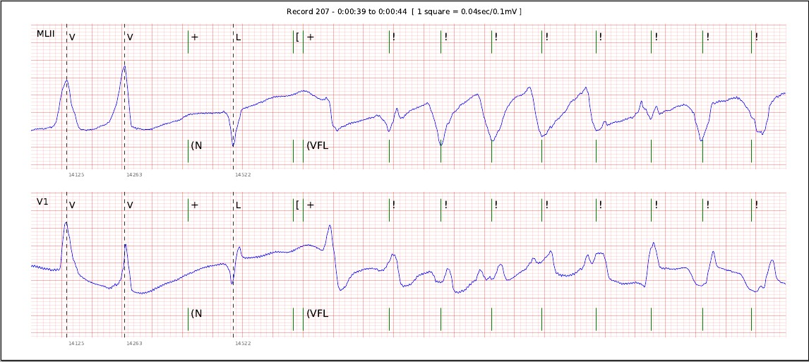

## mit2pdf

Utility to generate an annotated PDF from a WFDB MIT record.

### Getting started

This tool relies on the [WFDB software package](http://www.physionet.org/physiotools/wfdb.shtml) for signal and annotation reading purposes.
Once this dependency is satisfied, you can generate an annotated PDF from a record or a record fragment as shown in the following examples:

- Limit result to 50 seconds, use atr annotator, show grid and plot pages of 5 seconds:

        ./mit2pdf -r data/105 -a atr -l 50 --showGrid -d result.pdf -p 5

- Plot 20 seconds from second 00:24, and show only N,V and + annotations :

        ./mit2pdf  -r data/207 -o 00:00:24 -l 20 --showGrid --filter N,V,\+

- Plot the full record with the default options:

        ./mit2pdf  -r data/207

  ***(!)*** *Exporting a full 30 min record may take around half a minute (or five times that with grid) and result in a pdf document of 180 pages.*

### Annotations

All [annotation codes](https://www.physionet.org/physiotools/wpg/wpg_32.htm) are supported, but for a subset of them a more convenient visualization is implemented:

 * Beat annotations: `N`, `L`, `R`, `B`, `A`, `a`, `J`, `S`, `V`, `r`, `F`, `e`, `j`, `n`, `E`, `/`, `f`, `Q`, `?`
 * Wave start and end annotations: `(`,`)`
 * P-wave and T-wave peaks: `p`, `t`
 * R-peak: Use a note code `"` with an `r` in the `aux` field (**Non standard**)

For annotations non listed above, two vertical marks will be drawn at the annotation instant, with the annotation code and the content of the aux field as a string if present.

### Examples

Fragment from the record 100 of the  MIT-BIH Arrhythmia Database:

Fragment from the record 207 of the  MIT-BIH Arrhythmia Database:

### Available options:

 `-r RECORD` `--record=RECORD` Record to print

 `-a ANNOTATOR` `--annotator=ANNOTATOR` Annotator(s) to use. Use `,` to separate more than one (default=atr).

 `-o OFFSET` `--offset=OFFSET` Offset to start printing in seconds or as an absolute instant in the format hh:mm:ss (default=0)

 `-l LIMIT` `--limit=LIMIT`  Limit to print in seconds or as an absolute instant in the format hh:mm:ss (default=0)

 `-p PAGESIZE` `--pageSize=PAGESIZE` Number of seconds per page (default=10)

 `-f FILTER` `--filter=FILTER` Filter beat classes shown Ex:N,V

 `-b BEATINFO` `--beatInfo=BEATINFO` File with beat info (i.e. waves, peaks, ...)

 `-d OUTPUT` `--destination=OUTPUT` Output file
